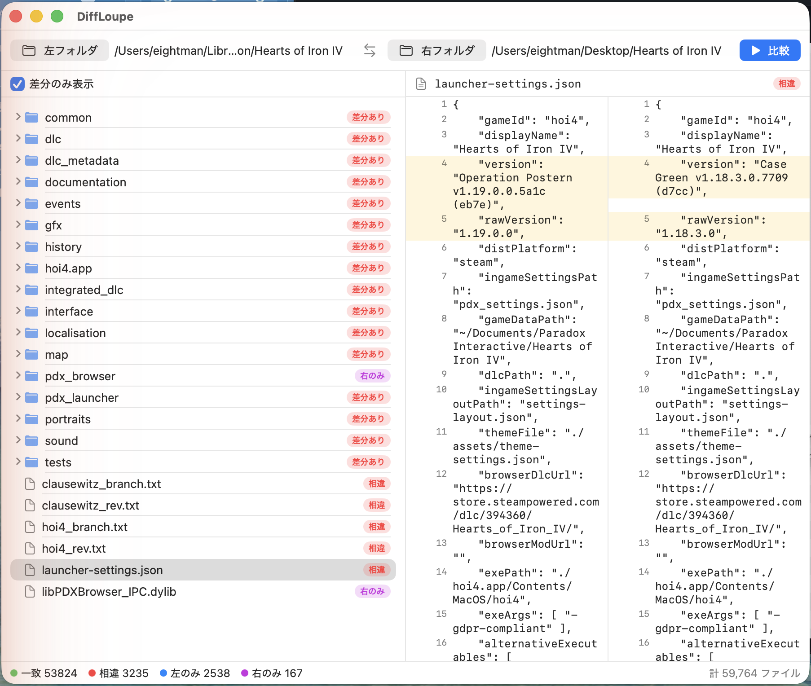

# DiffLoupe macOSネイティブ(Swift)版

「WinMerge難民のためのMac差分ツール」。
フォルダ納品物・バックアップ・写真フォルダの突き合わせ向けの、
軽くて即動く**2ペインのフォルダ比較**アプリです。SwiftUI + Swift Concurrencyによる
macOSネイティブ実装で、**外部依存ゼロ**(Foundation / CryptoKit / SwiftUIのみ)。



実フォルダ(約6万ファイルのゲームフォルダ同士)を比較した様子。
ツリーは「一致 / 相違 / 左のみ / 右のみ」に色分けされ、相違のテキストファイルを
選ぶと行単位の差分が横並びで表示されます(追加=緑、削除=赤、変更=黄)。

## 機能(v1)

- 左右フォルダの再帰比較。判定は **サイズ比較 → 一致時のみSHA-256** の段階方式
  (詳細は [SPEC.md](SPEC.md))
- 分類ツリー表示(一致 / 相違 / 左のみ / 右のみ / エラー、ディレクトリは子孫を集約)
- 「差分のみ表示」フィルタ
- テキストファイルの行単位差分ビュー(UTF-8、バイナリ自動判別、CRLF対応)
- `.git` / `.DS_Store` / `node_modules` を既定で除外(設定でトグル可)
- 走査・比較は完全非同期(進捗表示+キャンセル可能)。1万ファイル規模でもUIは固まりません
- ウィンドウサイズ・位置の記憶

## 動作環境

- macOS 13 (Ventura) 以降
- Apple Silicon / Intel 両対応(ユニバーサルバイナリ)
- ビルドには Xcode 15 以降(Swift 5.9+)

## ダウンロード / リリース

配布物の内容・インストール手順・初回起動時の注意は [RELEASE_NOTES.md](RELEASE_NOTES.md) にまとめています。

配布用の `.dmg` / `.zip` は次のコマンドで生成できます(成果物は `dist/` に出力。リポジトリには含めません):

```bash
cd SwiftUI
./Scripts/make_release.sh
# => dist/DiffLoupe-<version>.dmg, dist/DiffLoupe-<version>-macOS.zip
```

> 本アプリは公証(Notarization)未取得のため、配布物の初回起動時は
> 右クリック →「開く」か `xattr -cr /Applications/DiffLoupe.app` が必要です(詳細は RELEASE_NOTES.md)。

## ビルド方法

```bash
cd SwiftUI

# ビルド
xcodebuild -scheme DiffLoupe -project DiffLoupe.xcodeproj build

# テスト(同梱のTestFixturesで分類結果を検証)
xcodebuild -scheme DiffLoupe -project DiffLoupe.xcodeproj test

# ビルド成果物の場所を調べて起動する場合
xcodebuild -scheme DiffLoupe -project DiffLoupe.xcodeproj -showBuildSettings \
  | grep -m1 BUILT_PRODUCTS_DIR
open <BUILT_PRODUCTS_DIR>/DiffLoupe.app
```

Xcodeで開く場合は `SwiftUI/DiffLoupe.xcodeproj` を開き、スキーム `DiffLoupe` を実行してください。

### 大規模フォルダでの動作確認

1万ファイルの比較用フォルダペアを生成するスクリプトを同梱しています:

```bash
./Scripts/make_stress_fixtures.sh /tmp/DiffLoupeStress 10000
# アプリで /tmp/DiffLoupeStress/left と /tmp/DiffLoupeStress/right を比較
```

参考値: 10,000ファイル(うち相違100・左のみ100)の比較は Apple Silicon 実機で 1秒未満。
比較処理はすべてバックグラウンド実行され、走査中・比較中もUI操作とキャンセルが可能です。

## プロジェクト構造

```
SwiftUI/
├── DiffLoupe.xcodeproj/        # Xcodeプロジェクト(スキーム: DiffLoupe)
├── DiffLoupe/
│   ├── DiffLoupeApp.swift      # エントリポイント
│   ├── Models/DiffModels.swift # 分類ステータス・エントリ・ツリーノード
│   ├── Engine/
│   │   ├── FolderComparator.swift  # 走査+段階判定エンジン(SPEC.md §2)
│   │   ├── LineDiff.swift          # 行単位差分(CollectionDifference/Myers法)
│   │   └── TextFileLoader.swift    # UTF-8読込・バイナリ判別
│   └── UI/                     # SwiftUIビュー群
├── DiffLoupeTests/             # XCTest(分類・行差分・読込の検証)
├── TestFixtures/               # テスト用フォルダペア(同一・相違・片側のみ・バイナリ等)
├── Scripts/
│   ├── make_app_icon.sh        # resources/icons/icon.png から AppIcon.icns を生成
│   └── make_stress_fixtures.sh # 1万ファイル規模の検証用フォルダ生成
├── SPEC.md                     # 比較アルゴリズム仕様書(C++/Python版の読解結果を含む)
├── WORK_LOG.md                 # 作業ログ(判断の記録)
└── README.md                   # このファイル
```

## v1のスコープ外(実装していないもの)

以下はv1では意図的に実装していません:

- ヘックスビューア
- 画像比較
- 3-wayマージ
- ファイル編集
- フォルダ同期
- git連携

また、文字コードはUTF-8固定です(デコードできないファイルはバイナリ扱い)。
App Sandboxはv1では無効です(Mac App Store配布はv2以降の検討事項)。
フォルダへのアクセスは必ず `NSOpenPanel` 経由で行います。

## 関連ドキュメント

- [SPEC.md](SPEC.md) — 比較アルゴリズム仕様(C++版・Python版との相違点を含む)
- [WORK_LOG.md](WORK_LOG.md) — フェーズごとの作業ログ
- リポジトリ直下の [README.md](../README.md) — プロジェクト全体の入口
- [legacy/cpp/README.md](../legacy/cpp/README.md) — C++/Qt版(旧実装)について
